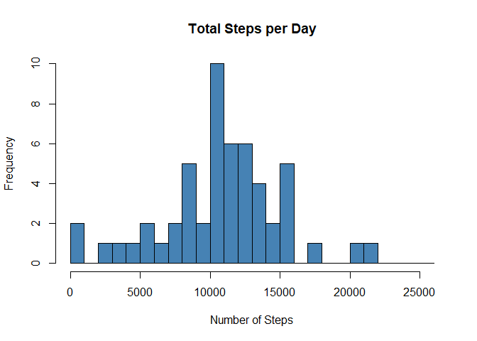
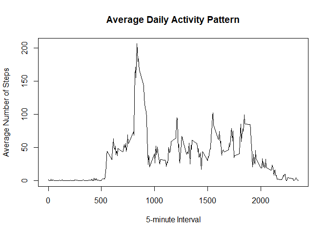
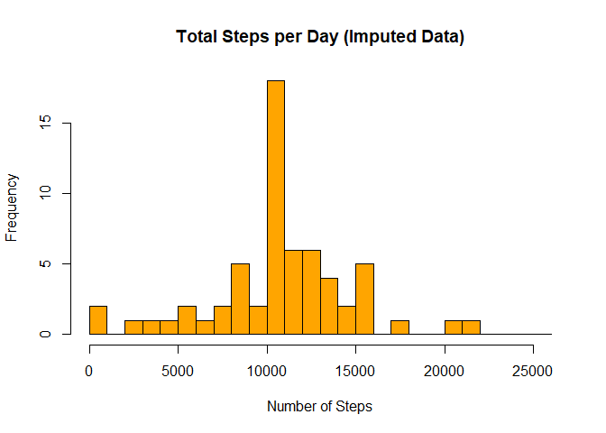
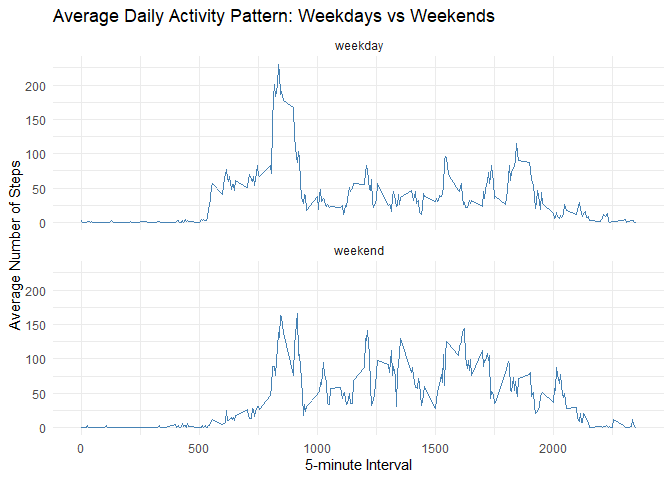

``` r
# Global options for all chunks
knitr::opts_chunk$set(echo = TRUE, message = FALSE, warning = FALSE, dev = "png", fig.path = "figure/")
```


## Loading and preprocessing the data

``` r
activity <- read.csv("activity.csv")
head(activity)
```

```
##   steps       date interval
## 1    NA 2012-10-01        0
## 2    NA 2012-10-01        5
## 3    NA 2012-10-01       10
## 4    NA 2012-10-01       15
## 5    NA 2012-10-01       20
## 6    NA 2012-10-01       25
```

``` r
str(activity)
```

```
## 'data.frame':	17568 obs. of  3 variables:
##  $ steps   : int  NA NA NA NA NA NA NA NA NA NA ...
##  $ date    : chr  "2012-10-01" "2012-10-01" "2012-10-01" "2012-10-01" ...
##  $ interval: int  0 5 10 15 20 25 30 35 40 45 ...
```


## What is mean total number of steps taken per day?

``` r
steps_per_day <- aggregate(steps ~ date, data = activity, FUN = function(x) sum(x, na.rm = TRUE))

breaks_seq <- seq(0, max(steps_per_day$steps) + 5000, by = 1000) 
hist(steps_per_day$steps,
     breaks = breaks_seq,
     main = "Total Steps per Day",
     xlab = "Number of Steps",
     ylab = "Frequency",
     col = "steelblue",
     xlim = c(0, max(breaks_seq)))
```

<!-- -->

``` r
mean_steps <- mean(steps_per_day$steps)
median_steps <- median(steps_per_day$steps)

mean_steps
```

```
## [1] 10766.19
```

``` r
median_steps
```

```
## [1] 10765
```

## What is the average daily activity pattern?

``` r
steps_per_interval <- aggregate(steps ~ interval, data = activity, FUN = function(x) mean(x, na.rm = TRUE))

plot(steps_per_interval$interval,
     steps_per_interval$steps,
     type = "l",
     main = "Average Daily Activity Pattern",
     xlab = "5-minute Interval",
     ylab = "Average Number of Steps")
```

<!-- -->

``` r
max_interval <- steps_per_interval$interval[which.max(steps_per_interval$steps)]
max_interval
```

```
## [1] 835
```

## Imputing missing values

``` r
total_NA <- sum(is.na(activity$steps))
total_rows <- nrow(activity)
percent_NA <- (total_NA / total_rows) * 100

cat("Total missing values:", total_NA, "(", round(percent_NA, 2), "%)\n")
```

```
## Total missing values: 2304 ( 13.11 %)
```

``` r
library(dplyr)
steps_per_interval <- activity %>%
  group_by(interval) %>%
  summarize(mean_steps = mean(steps, na.rm = TRUE))

activity_imputed <- activity %>%
  left_join(steps_per_interval, by = "interval") %>%
  mutate(steps = ifelse(is.na(steps), mean_steps,  steps)) %>%
  select(-mean_steps)

steps_per_day_imputed <- activity_imputed %>%
  group_by(date) %>%
  summarize(total_steps = sum(steps))

breaks_seq <- seq(0, max(steps_per_day_imputed$total_steps) + 5000, by = 1000)
hist(steps_per_day_imputed$total_steps,
     breaks = breaks_seq,
     main = "Total Steps per Day (Imputed Data)",
     xlab = "Number of Steps",
     ylab = "Frequency",
     col = "orange",
     xlim = c(0, max(breaks_seq)))
```

<!-- -->

``` r
mean(steps_per_day_imputed$total_steps)
```

```
## [1] 10766.19
```

``` r
median(steps_per_day_imputed$total_steps)
```

```
## [1] 10766.19
```

## Are there differences in activity patterns between weekdays and weekends?

``` r
library(dplyr)
library(ggplot2)

activity_imputed <- activity_imputed %>%
  mutate(day_type = ifelse(weekdays(as.Date(date)) %in% c("sábado", "domingo"), "weekend", "weekday"))

steps_by_daytype <- activity_imputed %>%
  group_by(interval, day_type) %>%
  summarize(mean_steps = mean(steps))

ggplot(steps_by_daytype, aes(x = interval, y = mean_steps)) +
  geom_line(color = "steelblue") +
  facet_wrap(~day_type, ncol = 1) +
  labs(title = "Average Daily Activity Pattern: Weekdays vs Weekends",
       x = "5-minute Interval",
       y = "Average Number of Steps") +
  theme_minimal()
```

<!-- -->


